# 2주차 (2022-03-15)
- 안드로이드 스튜디오 설치 및 깃허브 가입, 저장소 생성

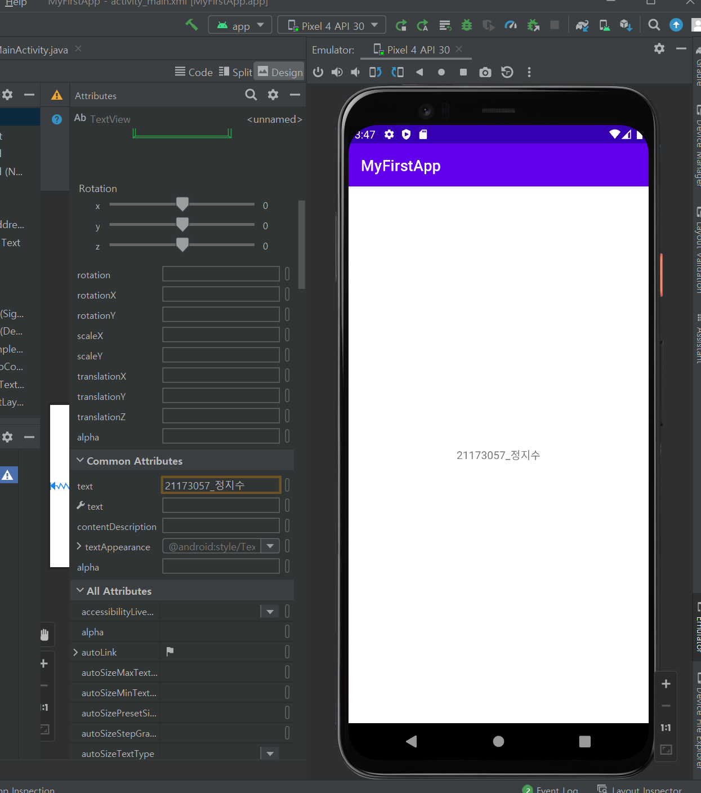</img>

# 3주차 (2022-03-22)
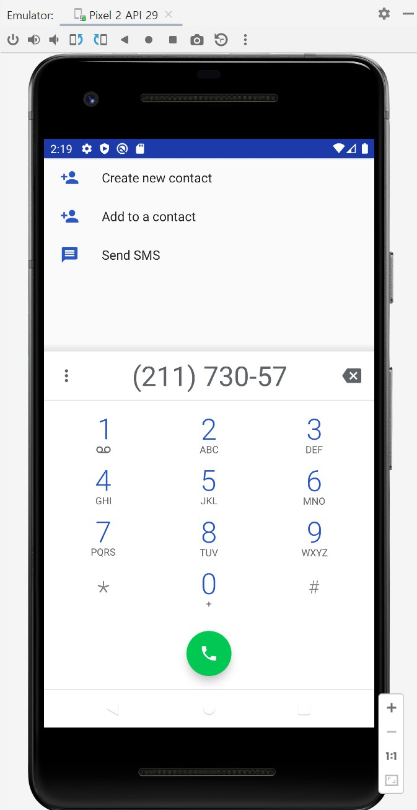</img>
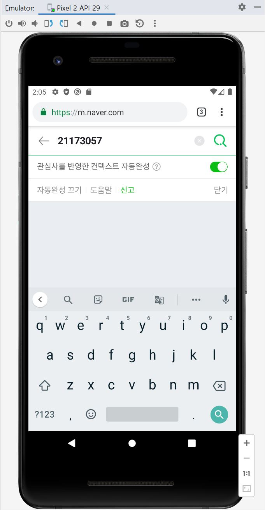</img>
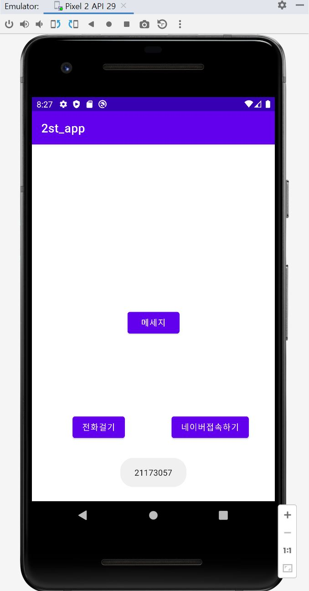</img>

# 5주차 (2022-04-10)
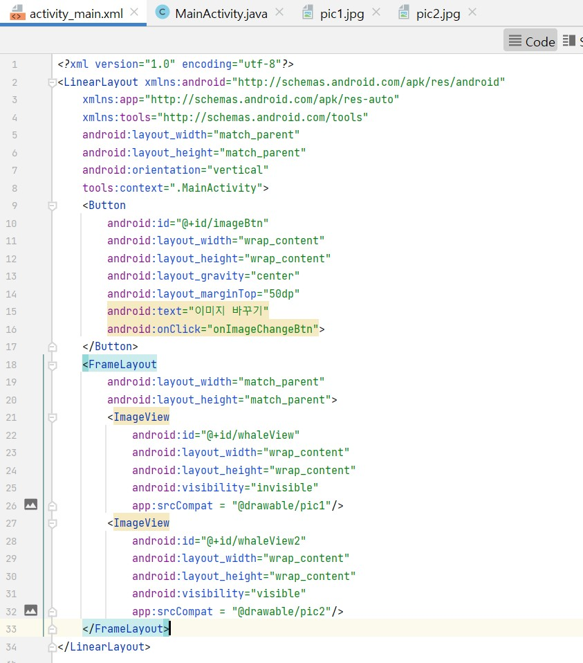</img>
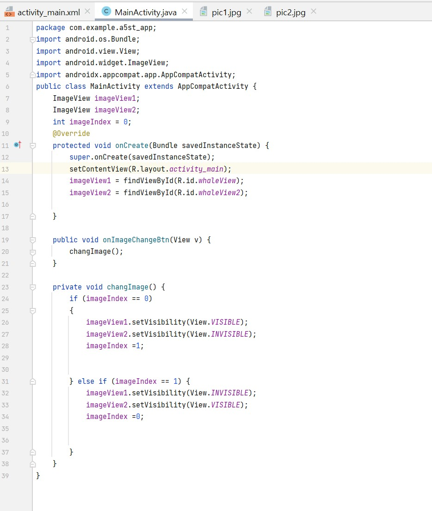</img>
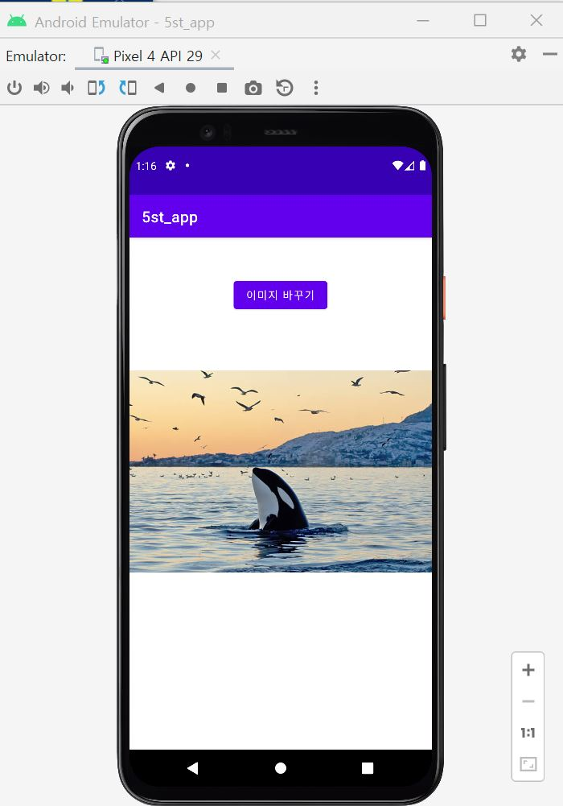</img>
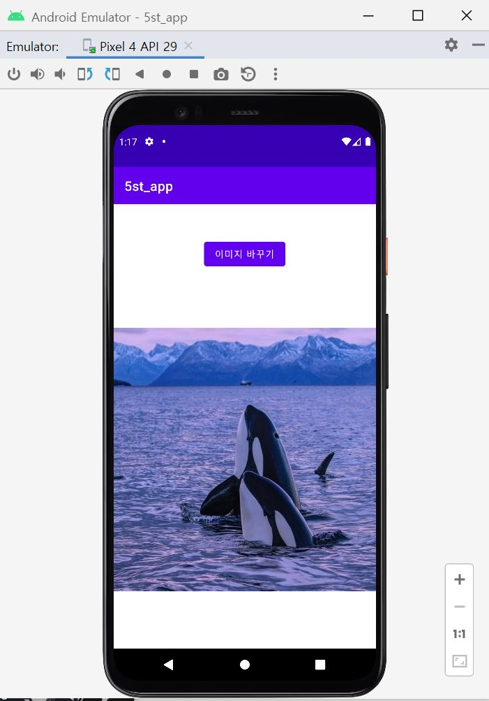</img>

# 10주차 (2022-05-16)
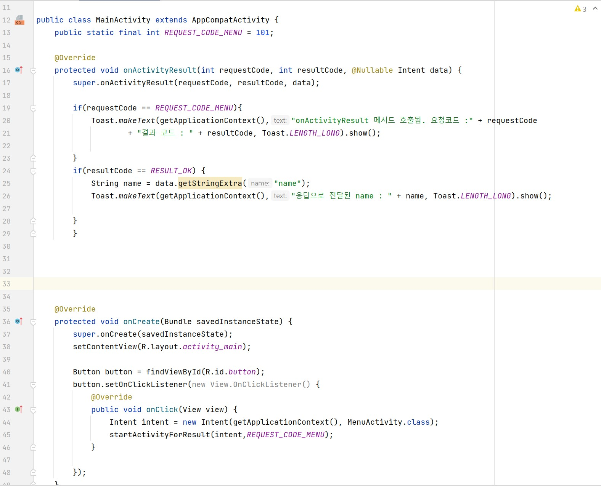</img>
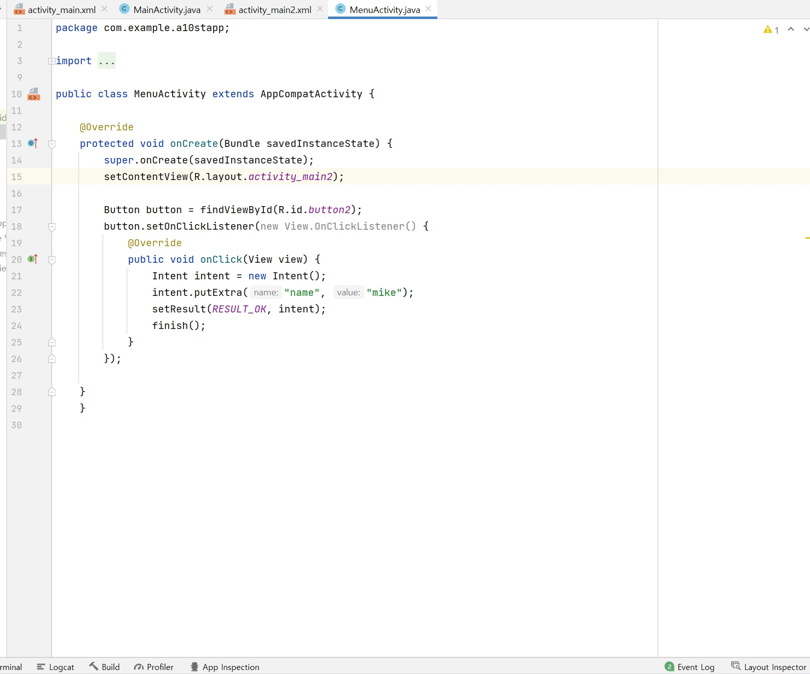</img>

-교안과 과제 영상 보며 똑같이 따라했는데 애뮬레이터 실행만 누르면 자동으로 꺼지고 상단바 화면에서 응답없음 으로 렉 걸리고 새 애뮬레이터를 만들어봐도, 재부팅했다가 다시해도 해결방법을 모르겠어서 일단 제가 작성한 소스 화면 올립니다.

# 11주차 (2022-05-17)
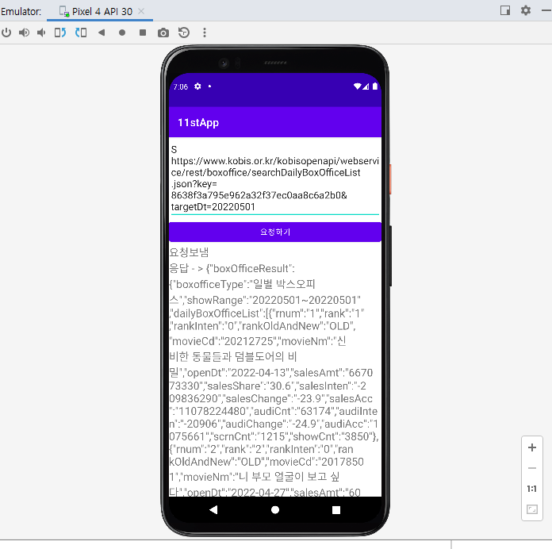</img>
